# WiA11y - Web Accessibility Crawler

WiA11y (pronounced "wh-ally") is a comprehensive web accessibility monitoring tool that helps teams identify, track, and resolve accessibility issues across their websites.



## Features

- **Automated Accessibility Scanning**: Crawl websites and automatically detect WCAG accessibility violations
- **Team Collaboration**: Organize scans by teams and domains for collaborative accessibility improvement
- **Detailed Reports**: View comprehensive reports with violation details, impact levels, and remediation suggestions
- **Progress Tracking**: Monitor accessibility scores over time with trend graphs and historical data
- **Customizable Settings**: Configure crawl depth, page limits, and WCAG standards (A, AA, AAA)
- **Email Notifications**: Receive regular accessibility summary reports via email
- **Domain Management**: Add notes and archive domains for better organization
- **User Role Management**: Network admins, team admins, and regular users with appropriate permissions
- **Customizable Branding**: Personalize the application with your organization's colors and logo
- **Dark Mode Support**: Toggle between light and dark themes for comfortable viewing

## Architecture

WiA11y follows a modern client-server architecture:

```
┌─────────────┐     ┌─────────────┐     ┌─────────────┐
│             │     │             │     │             │
│  Vue.js     │     │  Express    │     │  MongoDB    │
│  Frontend   │────▶│  Backend    │────▶│  Database   │
│             │     │             │     │             │
└─────────────┘     └──────┬──────┘     └─────────────┘
                           │
                           ▼
                    ┌─────────────┐
                    │             │
                    │  Selenium   │
                    │  WebDriver  │
                    │             │
                    └─────────────┘
```

- **Frontend**: Single-page application built with Vue.js 3
- **Backend API**: RESTful API built with Express.js
- **Database**: MongoDB for storing crawl data, violations, and user information
- **Crawler Engine**: Custom crawler using Selenium WebDriver and Axe-core for accessibility testing

## Accessibility Scoring System

WiA11y uses a weighted scoring system to calculate an overall accessibility score for each crawled website:

- **Score Calculation**: Starts at 100 and deducts points based on violations found
- **Violation Weights**:
  - Critical: 25 points per violation
  - Serious: 10 points per violation
  - Moderate: 4 points per violation
  - Minor: 1 point per violation
- **Score Interpretation**:
  - 90-100: Excellent
  - 70-89: Good
  - 50-69: Fair
  - 0-49: Poor

The scoring system can be customized by modifying the weights in `frontend/src/constants/scoreWeights.js`:

```javascript
export const VIOLATION_WEIGHTS = {
  critical: 25.0,
  serious: 10.0,
  moderate: 4.0,
  minor: 1.0
};
```

## Tech Stack

- **Frontend**: Vue.js 3, Chart.js, Font Awesome
- **Backend**: Node.js, Express
- **Database**: MongoDB
- **Testing**: Selenium WebDriver, Axe-core (accessibility testing engine)
- **Containerization**: Docker, Docker Compose

## Getting Started

### Prerequisites

- Node.js (v14+)
- MongoDB
- Docker and Docker Compose (for containerized deployment)
- Chrome/Chromium (for headless browser testing)

### Local Development Setup

1. **Clone the repository**

```bash
git clone https://github.com/yourusername/WiA11y.git
cd WiA11y
```

2. **Set up environment variables**

Create `.env.development` files in the backend directory:

```bash
# backend/.env.development
PORT=3000
MONGODB_URI=mongodb://localhost:27017/accessibility-crawler
JWT_SECRET=your_development_secret_key
CORS_ORIGIN=http://localhost:8080
SMTP_HOST=your_smtp_host
SMTP_PORT=587
SMTP_SECURE=false
SMTP_USER=your_email@example.com
SMTP_PASS=your_smtp_password
SMTP_FROM=WiA11y <noreply@example.com>
FRONTEND_URL=http://localhost:8080
API_URL=http://localhost:3000
```

3. **Install dependencies**

```bash
# Install backend dependencies
cd backend
npm install

# Install frontend dependencies
cd ../frontend
npm install
```

4. **Start MongoDB**

Make sure MongoDB is running locally or update the connection string in your environment variables.

5. **Start the development servers**

```bash
# Start backend server (from backend directory)
npm run dev

# Start frontend server (from frontend directory)
npm run serve
```

The application should now be running at:
- Frontend: http://localhost:8080
- Backend API: http://localhost:3000

### Docker Deployment

For production or containerized deployment:

1. **Set up environment variables**

Create a `.env.production` file in the backend directory with your production settings.

2. **Build and run with Docker Compose**

```bash
# For production
docker-compose up -d

# For development
docker-compose -f docker-compose.dev.yml up -d
```

## Initial Setup

After starting the application for the first time:

1. Register a new user account
2. The first user will automatically be assigned the network_admin role
3. Configure application settings (colors, title, logo)
4. Create teams and invite members
5. Start crawling websites to identify accessibility issues

## Security Considerations

When deploying WiA11y, consider the following security best practices:

1. **Environment Variables**: Never commit sensitive information like API keys or database credentials to version control. Use environment variables as shown in the setup instructions.

2. **JWT Secret**: Use a strong, unique JWT secret for token generation.

3. **HTTPS**: Always deploy the application behind HTTPS in production environments.

4. **Database Security**: Secure your MongoDB instance with authentication and proper network security rules.

5. **Regular Updates**: Keep all dependencies updated to mitigate security vulnerabilities.

6. **Rate Limiting**: Consider implementing rate limiting for the API to prevent abuse.

## User Roles

WiA11y supports three user roles with different permission levels:

1. **Network Admin**: Full access to all features, teams, and settings
   - Can manage all teams and users
   - Can configure application settings
   - Can view and manage all crawls

2. **Team Admin**: Administrative access to specific teams
   - Can manage team members
   - Can create and manage crawls for their teams
   - Can view team-specific reports and data

3. **User**: Basic access to assigned teams
   - Can create and view crawls for their teams
   - Can view reports and data for their teams

## License

[MIT License](LICENSE)

## Contributing

Contributions are welcome! Please feel free to submit a Pull Request.

## Support

If you encounter any issues or have questions, please file an issue on the GitHub repository.

---

Built with ❤️ for web accessibility 